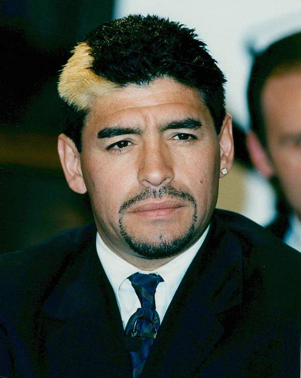

# Ignacio Colman

Buenas, me llamo Ignacio pero siempre me dijeron Nacho. Estoy en la Tecnicatura en Programación y este es mi cuarto cuatrimestre. Nunca había estudiado ni indagado en el mundo de la programación pero me resulta bastante interesante y divertido especialmente por la resolución de problemas y la modalidad de trabajo en equipo.

Hasta ahora, siento que mi forma de ser y de hacer las cosas ha cambiado gracias a la universidad. El compromiso que requiere y la manera de pensar que ésta carrera en particular fomenta me han hecho más estructurado en casi todo lo que hago, lo cual me funciona bien.

No tengo mucho mas que decir pero me quedo con una frase de un profesor de la materia Programación Estructurada que me gustaría mencionar: "programar es comunicar pero también es jugar".

Pd. Me estaba olvidando de la foto, adjunto una que me sacaron el otro día medio distraído.

Saludos!!

